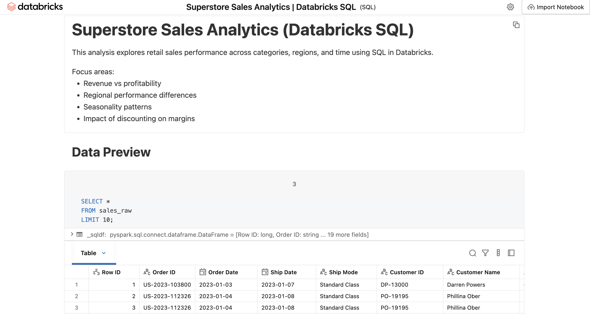
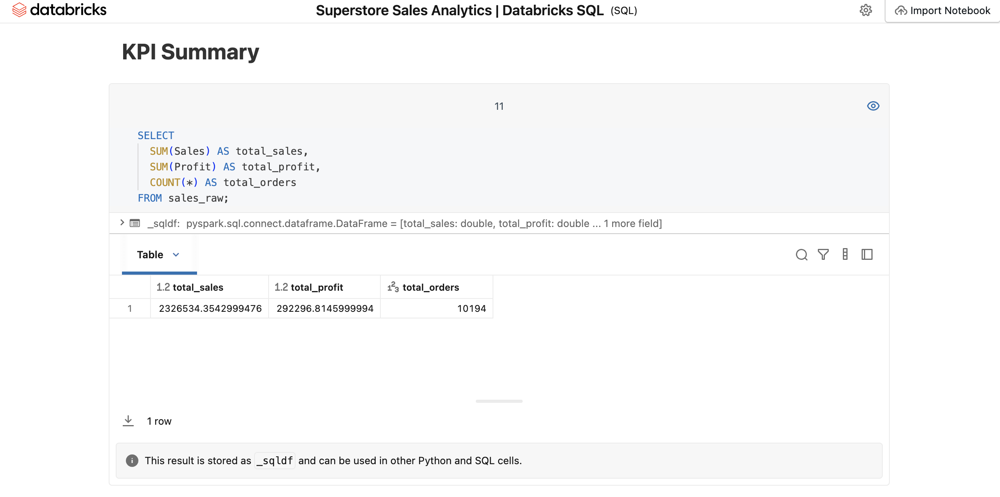
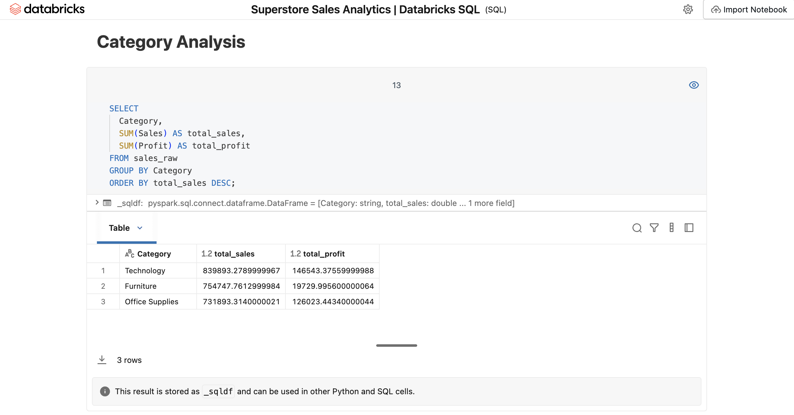
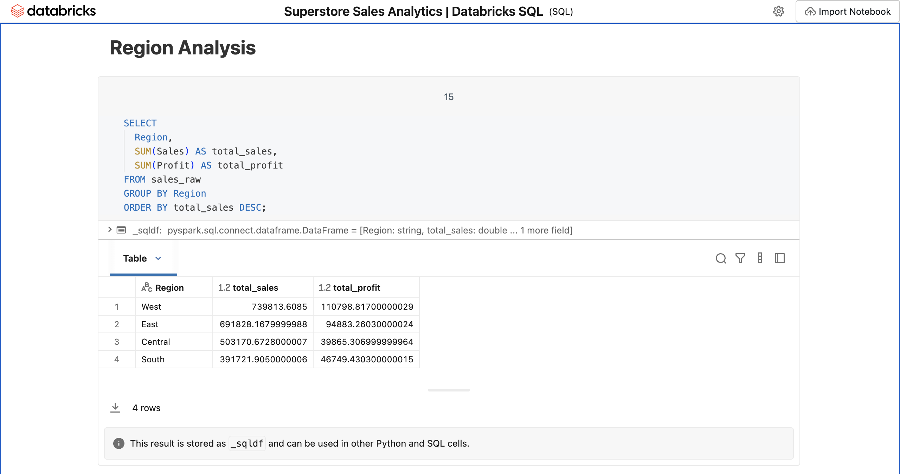
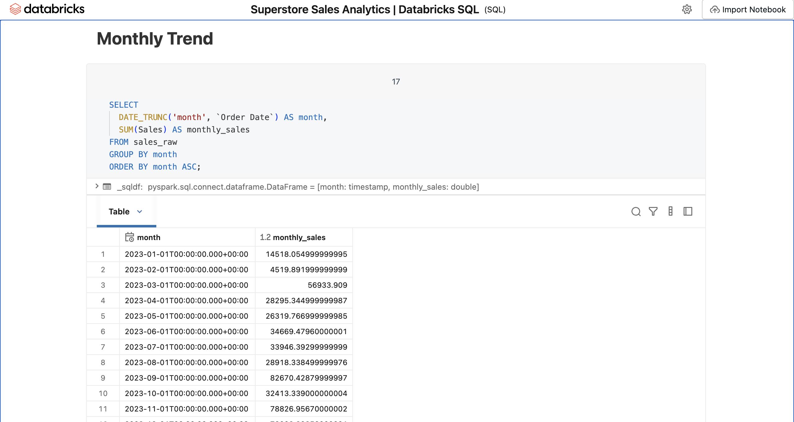
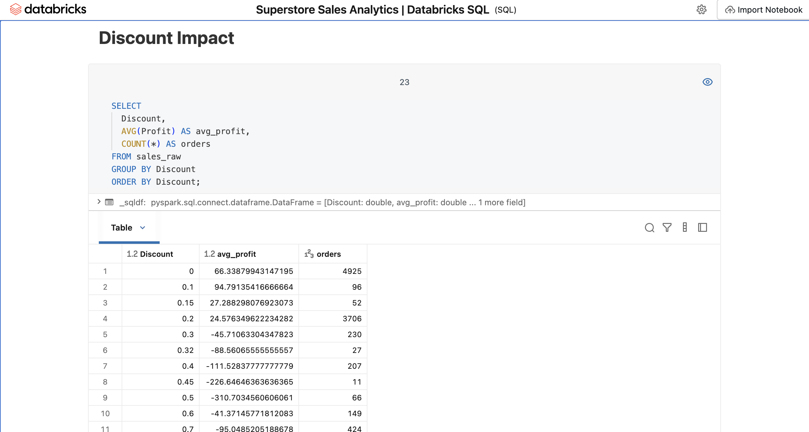

# Superstore Sales Analytics | Databricks SQL

## 📑 Table of Contents
- [Project Overview](#-project-overview)  
- [Objectives](#-objectives)  
- [Methodology](#-methodology)  
- [Exploratory Analysis (Visuals)](#-exploratory-analysis-visuals)  
- [Key Insights Summary](#-key-insights-summary)  
- [Business Recommendations](#-business-recommendations)  
- [Tools & Technologies](#%EF%B8%8F-tools--technologies)  
- [Project Structure](#-project-structure)  
- [Notes](#%EF%B8%8F-notes)  
- [Part of a Learning Journey](#-part-of-a-learning-journey)  
- [Links](#-links)  
- [Author](#-author)  
- [License](#-license)  

---

## 📌 Project Overview
This project analyzes retail transaction data using SQL in Databricks to evaluate sales performance, profitability, and operational patterns across categories, regions, products, and time.

The analysis focuses on identifying revenue drivers, margin inefficiencies, and the impact of discounting on profitability to support data driven business decision making.

---

## 🎯 Objectives
- Analyze overall sales and profit performance  
- Evaluate category level revenue and margin differences  
- Identify regional performance trends  
- Examine seasonality in monthly sales  
- Assess product level contribution to revenue and profit  
- Analyze the impact of discounting on profitability  

---

## 🧠 Methodology
- **Data Source:** Superstore retail dataset (CSV format)  
- **Platform:** Databricks (SQL Warehouse)  

### Data Preparation:
- Uploaded dataset into Databricks  
- Created structured table (`sales_raw`)  
- Validated schema and data integrity  

### Data Exploration:
- Aggregations using SQL (SUM, COUNT, AVG)  
- Time based analysis using `DATE_TRUNC`  
- Grouped analysis by category, region, and product  

### Data Quality Checks:
- Verified row counts and unique order IDs  
- Checked for missing key fields  

---

## 📊 Exploratory Analysis (Visuals)

### Project Overview

### KPI Summary

### Category Analysis

### Region Analysis

### Monthly Trend

### Discount Impact

---

## 📊 Key Insights Summary

The following insights are derived from SQL based exploratory analysis in Databricks and supported by the visual outputs above.

- **Category performance:** Technology and Office Supplies drive strong profitability, while Furniture underperforms significantly on margin despite high sales volume, indicating inefficiencies in pricing or cost structure.

- **Regional performance:** The West and East regions lead overall performance, while Central and South lag behind, suggesting potential operational or market differences impacting results.

- **Seasonality trends:** Sales exhibit clear seasonality, with consistent peaks in the year end period (November – December) and weaker performance in early months, highlighting demand concentration during peak seasons.

- **Profitability differences:** Margin performance varies widely across categories, reinforcing that high revenue does not necessarily translate into strong profitability.

- **Product-level insights:** A small number of high revenue products contribute disproportionately to total sales, but not all of them are profitable, indicating the need to evaluate product level margins alongside volume.

- **Discount impact:** Increasing discount levels are strongly associated with declining profitability, with higher discount tiers consistently leading to negative returns, demonstrating the trade off between volume and margin.

---

## 💡 Business Recommendations

- Prioritize high margin categories (Technology, Office Supplies) for growth  
- Reevaluate Furniture pricing, cost structure, or vendor strategy  
- Optimize discount strategy to avoid margin erosion beyond 20–30%  
- Focus on high performing regions (West, East) while improving underperforming regions  
- Identify and promote profitable top performing products  

---

## 🛠️ Tools & Technologies
- Databricks (SQL Warehouse, Databricks SQL)  
- SQL (aggregation, grouping, time series analysis)  
- CSV data ingestion  
- GitHub (version control & project hosting)  

---

## 📁 Project Structure
- `superstore_sales.dbc` – Databricks SQL Notebook (analysis)  
- `data/` – Source dataset
- `screenshots/` – Notebook screenshots  
- `README.md` – Project documentation  

---

## ⚠️ Notes
- This is an exploratory analytics project (not predictive modeling)  
- Dataset represents historical retail transactions  
- Insights are based on aggregated data and may require deeper investigation for production use  

---

## 🧵 Part of a Learning Journey
This project is part of my transition into data analytics and data engineering, building hands on experience with modern data platforms.

It reflects applied learning from:
- Google Data Analytics Certificate  
- SQL and data modeling practice  
- Real world business analysis scenarios  

---

## 🔗 Links
- GitHub Repository: *https://github.com/barissoy/databricks/tree/main/superstore-sales-analytics*  
- HTML Report: [View Full Report](https://barissoy.github.io/databricks/superstore-sales-analytics/superstore_sales_analysis_databricks_export.html)  
- Databricks Notebook: *https://dbc-e720b4f3-ebea.cloud.databricks.com/editor/notebooks/4126665574910875?o=7474658574974869*  

---

## 👤 Author
Baris Soy  
Data Analyst | SQL | Python | Data Analytics  

---

## 📜 License
This project was created for educational and portfolio purposes.  
All code and analysis are free to use, modify, and learn from.